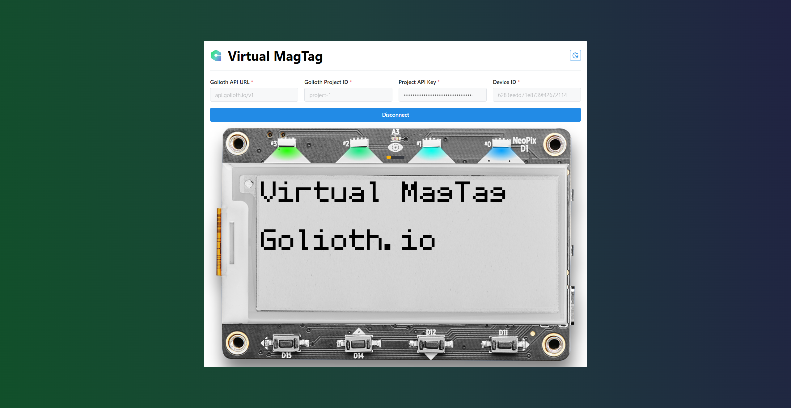

## Golioth Virtual MagTag

Control your MagTag using [Golioth Cloud](https://console.golioth.io) LightDB.



### Installation

```
  yarn
  yarn dev
```

## Usage

Fill the required fields:

- **Golioth API URL**: Most of the cases use: `api.golioth.io/v1`.
- **Golioth Project Id**: Slugyfied version of your project name. You can find it [here](https://console.golioth.io/projects).
- **Project API Key**: Required API Key to connect to your project services. You can create one [here](https://console.golioth.io/api-keys).
- **Device ID**: Your MagTag ref at the golioth devices. You can create/find it [here](https://console.golioth.io/devices)

Then, click on the `Listen to LightDB` button.

## Features

- **Control LEDs (#0, #1, #2, #3) States and Color** 🚥
- **Test Current Light Sensor Readings** 💡
- **Control Display Text** ⌨️
- **Send Buttons (D11, D12, D14, D15) Press** 🎛️

## Required LightDB State ([digital twin](https://blog.golioth.io/tag/digital-twin/))

```json
{
  "desired": {
    "buzz": 0,
    "leds": {
      "0": "#000000",
      "1": "#000000",
      "2": "#000000",
      "3": "#000000"
    },
    "text": "sample text"
  },
  "state": {
    "accX": 0,
    "accY": 0,
    "accZ": 0,
    "leds": {
      "0": "#000000",
      "1": "#000000",
      "2": "#000000",
      "3": "#000000"
    },
    "light": 0,
    "text": "sample text"
  }
}
```

## Firmware

[TODO]
